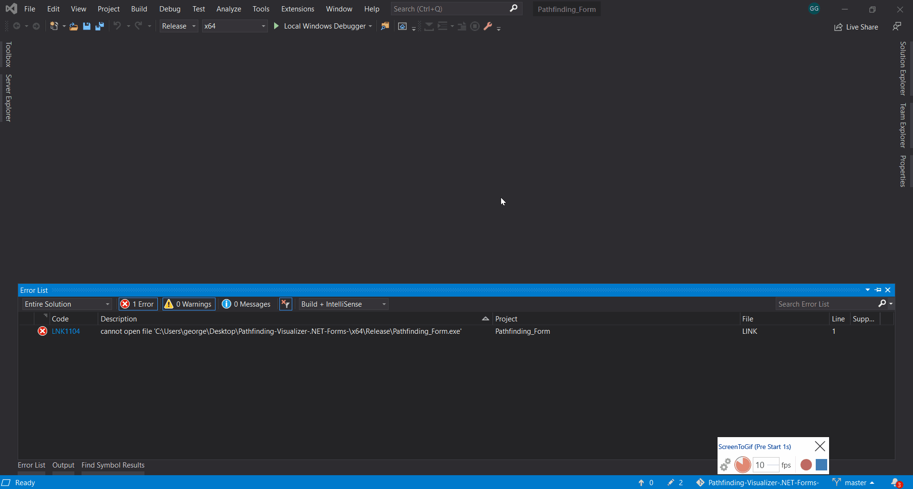

# Pathfinding-Visualizer-.NET-Forms-

Visualization of how 3 pathfinding algorithms work(and one more random search algorithm for testing purposes). Diagonal movement is supported.

Currently supported algorithms:
* [A*](https://en.wikipedia.org/wiki/A*_search_algorithm)
* [GreedyBFS](https://en.wikipedia.org/wiki/Best-first_search)
* [Dijkstra](https://en.wikipedia.org/wiki/Dijkstra%27s_algorithm)

Distance calculation: 
* [Manhattan distance](https://en.wikipedia.org/wiki/Taxicab_geometry)
* [Chebysev distance](https://en.wikipedia.org/wiki/Chebyshev_distance)
* [Euclidean distance](https://en.wikipedia.org/wiki/Euclidean_distance)

You can also load a map from a file, check [Grids for testing](https://github.com/ggiap/Pathfinding-Visualizer-Qt5-/tree/master/Grids_for_testing) folder for reference on how to create them. Furthermore, obstacles can be added on the cells you don't want the algorithm to pass through.

## Built With

* [SFML](https://www.sfml-dev.org/) - The framework used for rendering
* [CMake](https://cmake.org/) - Build System
* [.NET Forms](https://docs.microsoft.com/en-us/cpp/dotnet/dotnet-programming-with-cpp-cli-visual-cpp?view=vs-2019) - Used to create the form
* [conan](https://conan.io/) - Open source package manager/dependency manager

## Prerequisites

### $Linux
Check my [Qt5 application](https://github.com/ggiap/Pathfinding-Visualizer-Qt5-) for the linux version.


### $Windows

#### SFML
```
My preffered way of installing c++ libraries on windows is with vcpkg
```
You can check out the official repo [here](https://github.com/microsoft/vcpkg).

#### Python/pip
```
Download and install Python and pip if you don't have them already
```

#### conan
```
pip install conan
```

#### CMake
```
Download and install cmake
```

#### C++/CLI support
```
Make sure you have C++/CLI support for v142 build tools (14.20) or later installed. If not install it from Visual Studio Installer.
```

## Installing

### Clone the repo
```
git clone https://github.com/ggiap/Pathfinding-Visualizer-.NET-Forms-.git
```

### Build the executable
```
Locate the .sln file and open it
```
```
Select Build -> Build Solution
```
```
Select Debug -> Start without debugging
```




## Controls

* **Left Mouse Click:**   Set starting cell

* **Right Mouse Click:**  Set finish cell

* **Middle Mouse Button:** Add/Remove obstacle

## License

This project is licensed under the MIT License - see the [LICENSE.md](https://github.com/ggiap/Pathfinding-Visualizer-Qt5-/blob/master/LICENSE) file for details

